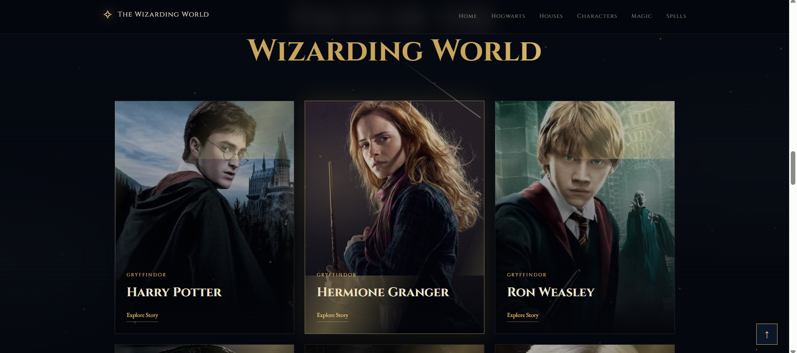

# 🔮 The Wizarding World

A single-page fan website built with HTML, CSS, and JavaScript.

**Live Demo:** https://kaveeshamalindi.github.io/hogwarts-explorer/

<p align="center">
  
</p>

---

## 🎨 Files

- `index.html` – page content
- `style.css` – styling and animations
- `script.js` – interactivity

---

## 🎃 How to Run

1. Download or clone the project.

```bash
git clone https://github.com/Kaveeshamalindi/hogwarts-explorer.git
```

3. Just open `index.html` in your browser.
4. No installation needed.

---

## 🎬 Sections

- Hero
- Hogwarts
- Houses
- Characters
- Magic
- Spells

---

 Don't forget to hit the ⭐ if you like this repo. 
